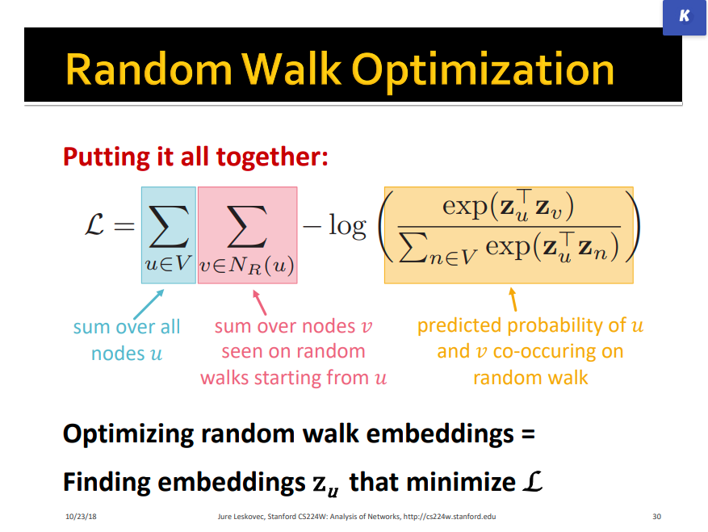
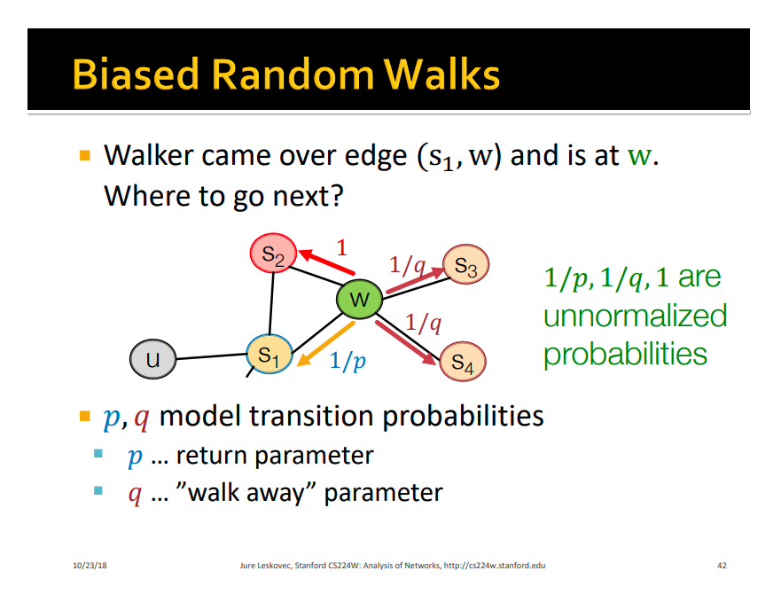
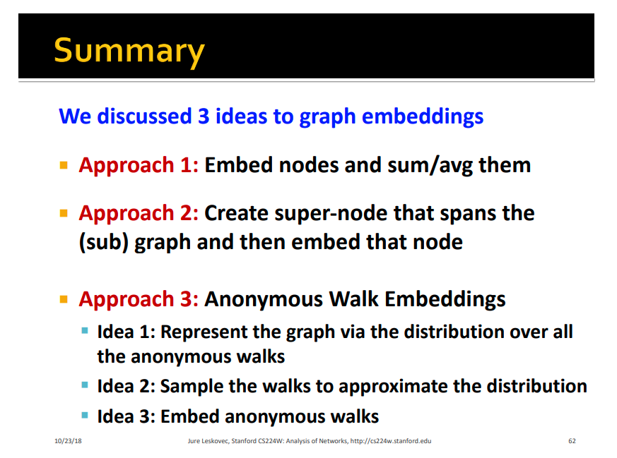

## References

- This [video](http://snap.stanford.edu/class/cs224w-2018/handouts/09-node2vec.pdf) and its [slides](https://www.youtube.com/watch?v=YrhBZUtgG4E)

## Learning node embeddings

1. Define an encoder that maps each node to d-dimensional feature vector.
2. Define node similarity function. This function sees how similar 2 nodes origionally and sees how similar 2 nodes after mapping to d-dimensional vector
3. optimize the encoder parameters to have the same similarity before and after mapping.

- similarity can be something like cosine similarity Z.T \* Z
    

# Random Walks

### How to define Node similarity

- Random Walk approaches
  - so this says starting from a node, what is probability that I will reach another node
- I want the Z.T \* Z to be proportional the probability of the random walk.

- Why Random walks?
  - Expressivity: now I have a flexible representation of the node similarity in both local and higher-order neighbourhood information.
  - Efficiency: Don't need to consider all node pairs when training, only need to consider pairs that co-occur on random walks.

### optimization

- G = (V,E)
- goal is to learn mapping z: u -> Rd

- log-likelihood objective:
  - max summation(log(N(u)|Z_u))
  - where N(u) is a set of neighbours of the node u (generated by random walks)
    
- a problem with that is that it it takes quadratic computations and that's expensive.
- a solution for that is that instead of summing over all nodes in the denominator we sum over k-samples (negative sampling) that we decide
- Also passing the dot product through a sigmoid makes a good normalization before the exponential.

### Down sides of Random walks

- It is too constrained
    

# Node2Vec

### Goal

- Embed nodes with similar network neighbourhood close in the feature space, simply saying that that similarity is preserved before and after embedding.

#### Key observation

- Flexible notion of network neighbourhood N(u) using 2nd order random walk, which simply means to remember where i came from
  
- p is the retrun parameter (return to the node i came from)
- q is the in-out parameter is the ratio between BFS and DFS

- BFS-like behaviour: low p value
- DFS-like behaviour: low q value

# Embedding whole graphs

- you can simply sum all the embeddings of the graph.
- we can create a virtual node that connects to all the nodes of this graph and then use its embedding to represent the whole graph
  

# General notes

- Node2Vec works well for node classification, but less performent in link prediction tasks.
- Random walks are generally more efficient
    
    
