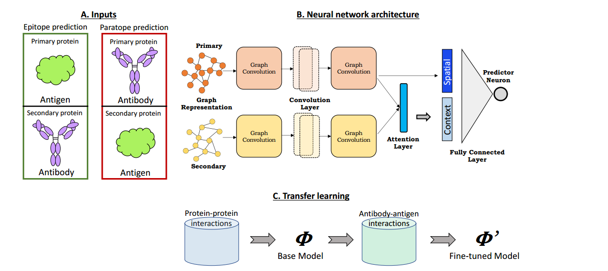

# The architecture

## How it is built?

- graph convolutions to capture the spatial relationships of the interfaces.

- An attention layer to enable each protein’s interface predictions to account for the potential binding context provided
  by its partner

- transfer learning to leverage the larger set of data available for general protein-protein interactions to provide a baseline
  model to be fine-tuned with antibody-antigen data.

- There are two networks one to find the epitope on the antigen and one to find the paratope on the antibody

- note: while training the epiptope network the input is the primary of antigen and the secondry of the antibody (to find context) and vice versa

## Inputs to the network

- Each protein structure is represented as a graph. **nodes** are amino acids and edges with Cβ-Cβ distance less than 10Å. For Gly residues, which lack a Carbon, Cα was used.

- Each node is associated with a 62-dimension feature vector

  - (20-D) one-hot encoding of the amino-acids (because there are 20 of them).

- (20-D) a conservation profile for that position across a set of homologous proteins return by PSI-Blast.

- PSI-Blast is a scoring technique describing how similar this to other sequences in a database.

- (20-D) a local amino acid profile indicating the number of times each amino acid has appeared within 8A of the residue.

- (2-D) the relative and absolute solvent accessible surface area. (This is computed be STRIDE).
